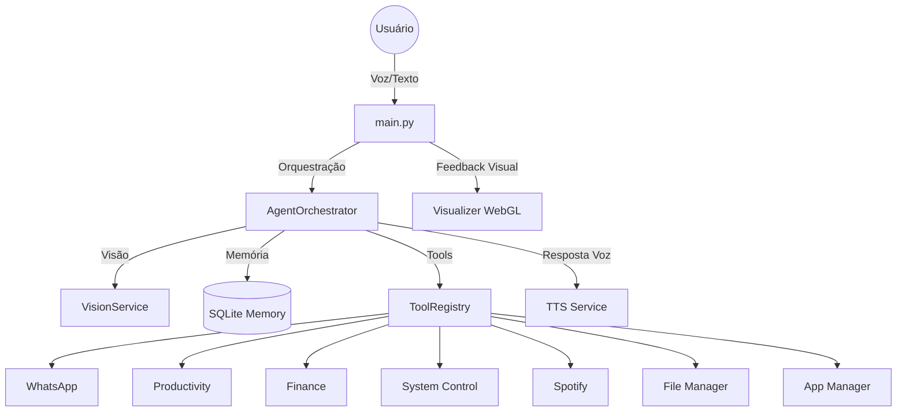

# 🌌 IA Assistente Autônoma (Windows Personal AI)

Uma assistente virtual de alto desempenho para Windows, projetada para ser sua companheira digital autônoma. Este projeto integra visão computacional, processamento de voz avançado, memória persistente e uma interface visual reativa (Orb) baseada em WebGL.

---

## ✨ Principais Funcionalidades

- **🎙️ Interface de Voz Inteligente**: Entrada via microfone (STT) e resposta via áudio (TTS) com suporte a interrupções em tempo real.
- **👁️ Visão de Tela Multimodal**: Capacidade de "enxergar" e analisar o que você está fazendo no Windows usando Gemini Vision.
- **🔮 Orb Visual Reativo**: Um visualizador WebGL dinâmico que expressa emoções e estados da IA (pensando, ouvindo, falando).
- **🧠 Memória Evolutiva**: Sistema de memória curta e longa (SQLite) com Mini-RAG para recordar fatos, preferências e evoluir a persona.
- **🛠️ Orquestração de Ferramentas**: Automação real de tarefas no sistema, finanças, produtividade e comunicação.
- **📱 Integração WhatsApp**: Envio de mensagens de forma invisível via Mudslide CLI.

---

## 🚀 Guia Rápido

### 1. Requisitos e Setup
1. **Python 3.10+** instalado.
2. Clone o repositório e crie um ambiente virtual:
   ```bash
   python -m venv .venv
   source .venv/bin/activate  # ou .venv\Scripts\activate no Windows
   ```
3. Instale as dependências:
   ```bash
   pip install -r requirements.txt
   ```
4. Configure suas chaves no `.env` (use `.env.example` como base):
   - `GEMINI_API_KEY`: Essencial para visão e lógica principal.
   - `OPENROUTER_API_KEY` / `NVIDIA_API_KEY`: Fallbacks para chat.
   - `MURF_API_KEY`: Opcional para voz premium.

### 2. Execução
- **Modo Completo (Recomendado)**:
  ```bash
  python -m src.main
  ```
- **Diagnóstico de Áudio**:
  ```bash
  python -m src.check_audio
  ```

---

## 📂 Arquitetura do Projeto



---

## 🛠️ Ferramentas Disponíveis (Toolbox)

| Ferramenta | Comando de Exemplo | Descrição |
| :--- | :--- | :--- |
| **🎵 Spotify** | `"toque Bohemian Rhapsody"`, `"que música tá tocando?"` | Controle local do Spotify Desktop (play, pause, skip, busca). |
| **📂 Gerenciador de Arquivos** | `"quantos arquivos tem na pasta Downloads?"` | Lista, conta, move, copia, deleta e lê arquivos. |
| **🖥️ Gerenciador de Apps** | `"abre Chrome, Spotify e VS Code"` | Lista apps instalados/abertos, abre em batch, fecha e foca janelas. |
| **📱 WhatsApp** | `"mande um zap para João falando que chego em 5min"` | Envio via Mudslide CLI com anti-spam. |
| **👁️ Visão** | `"olha minha tela e resume esse documento"` | Captura de tela + análise Gemini. |
| **💰 Finanças** | `"adicione gasto de 50 reais com pizza"` | Controle financeiro local. |
| **📋 Produtividade** | `"adicione tarefa estudar python na prioridade alta"` | Integração com Super Productivity. |
| **🔊 Sistema/Mídia** | `"aumente o volume"`, `"info do sistema"` | Controle de mídia e informações do PC. |
| **🧠 Memória** | `"lembre que eu gosto de café sem açúcar"` | Persistência de fatos e preferências. |
| **📝 Clipboard** | `"resuma esse texto e copie pra mim"` | Lê e escreve na área de transferência. |
| **✏️ Notepad** | `"escreva 'olá mundo' no bloco de notas"` | Escreve texto diretamente no Bloco de Notas. |

---

## 🎵 Spotify (Sem Premium)

Controle local do aplicativo desktop do Spotify — sem precisar de conta Premium ou API Web:
- **Buscar e tocar**: Abre a busca dentro do app e tenta reproduzir automaticamente.
- **Controles básicos**: Play, Pause, Próxima, Anterior via teclas de mídia do Windows.
- **Identificar música**: Lê o título da janela do Spotify para saber o que está tocando.

## 📂 Gerenciador de Arquivos

Acesso restrito às pastas mais usadas do seu usuário:
- **Downloads**, **Documentos**, **Desktop**, **Imagens**, **Músicas**, **Vídeos**
- Ações: listar, contar, buscar, mover, copiar, deletar, renomear, ler e escrever arquivos.
- Pastas sensíveis do sistema (Windows, Program Files) são **bloqueadas** automaticamente.

## 🖥️ Gerenciador de Apps

Controle completo dos aplicativos do Windows:
- **Listar apps instalados** (via Registro do Windows) e **janelas abertas**.
- **Abertura em batch**: `"abre Chrome, Spotify e VS Code"` — abre todos de uma vez.
- **Fechar apps** por nome e **focar janelas** que estão em segundo plano.

---

## 🎨 Visualizador (Orb)

O visualizador (`src/services/visualizer_web`) é uma aplicação Flask/WebSocket que roda um Orb reativo.
- **Auto-Abertura**: O navegador abre automaticamente em `http://localhost:5123`.
- **Estados Visuais**:
  - 🔵 **Listening**: Ouve sua voz.
  - 🟣 **Thinking**: Processa a resposta na LLM.
  - 🟢 **Speaking**: Sincroniza a animação com a fala.
  - 🔴 **Error**: Alerta visual para falhas de API ou conexão.

---

## ⚙️ Configurações Avançadas (.env)

- `USE_MIC=true`: Habilita a escuta contínua.
- `STT_LANGUAGE=pt-BR`: Idioma para reconhecimento de voz.
- `TTS_PROVIDER=murf`: Use `murf` para voz realista ou `local` para offline rápido.
- `GEMINI_MAX_RPM=10`: Controle de cota para evitar bloqueios na API gratuita.
- `REQUIRE_CRITICAL_CONFIRMATION=true`: Pede confirmação por voz para ações sensíveis (como deletar arquivos).

---

## 🛡️ Segurança e Privacidade

- **Local-First**: Suas notas, memórias e registros financeiros são salvos em um banco SQLite local (`data/memory.db`).
- **Controle de Ações**: Ações críticas (deletar, mover, fechar apps) são filtradas pelo `ToolRegistry` e exigem permissão explícita.
- **Acesso Restrito a Arquivos**: O gerenciador de arquivos só acessa pastas do usuário (Downloads, Documents, Desktop, etc.). Pastas do sistema são bloqueadas.
- **Invisibilidade**: Automações como WhatsApp rodam em background para não interromper seu fluxo de trabalho.

---

✨ *Desenvolvido para ser a interface definitiva entre você e seu PC.*
